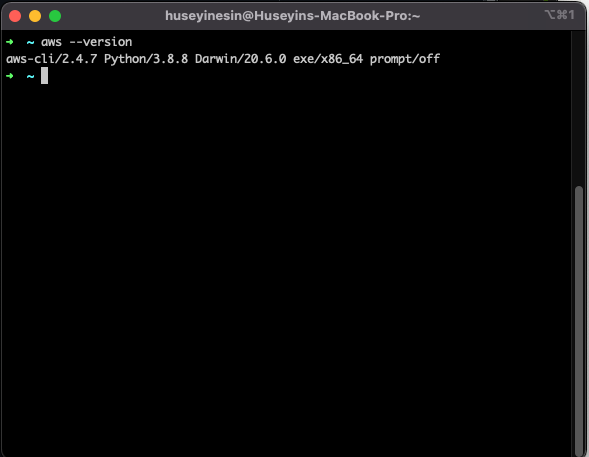
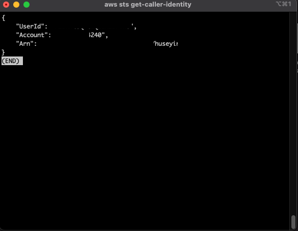
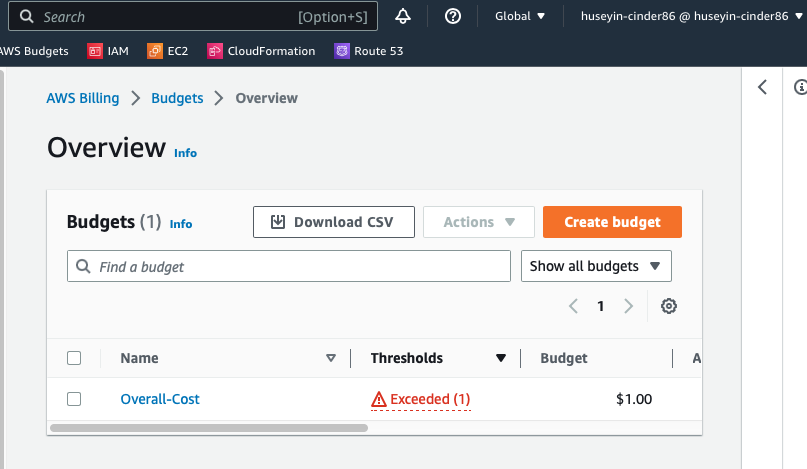
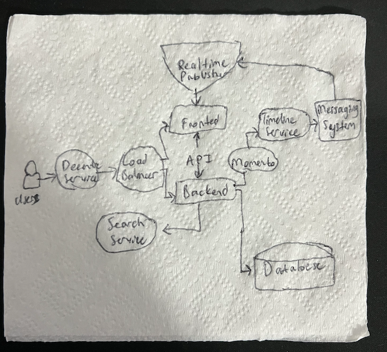
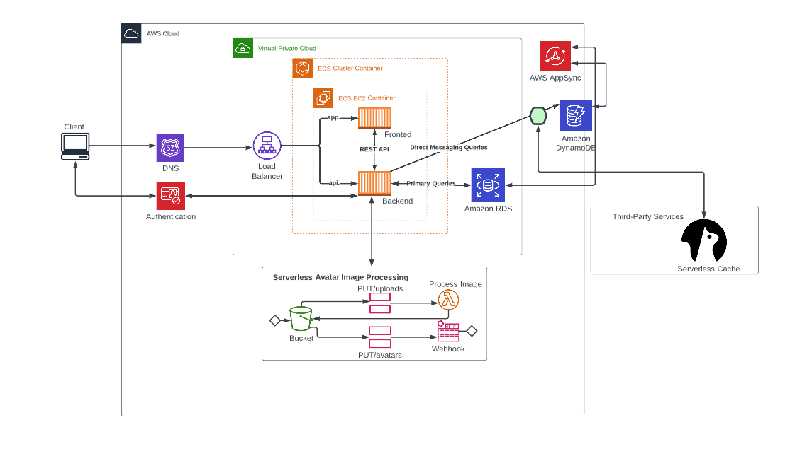

# Week 0 — Billing and Architecture

## Required Homework/Tasks

### Install and Verify AWS CLI 

I was not able to use Gitpod or Github Codespaces due to browser issues.
So I decided to use a local enviroment.

In order to prove that I am able to use the AWS CLI.
I am providing the instructions I used for my configuration of my local machine on macos.

I did the following steps to install AWS CLI.

I installed the AWS CLI for MACOS via command in **Command Prompt**:

I followed the instructions on the [AWS CLI Install Documentation Page](https://docs.aws.amazon.com/cli/latest/userguide/getting-started-install.html)


```
sudo ln -s /folder/installed/aws-cli/aws /usr/local/bin/aws
sudo ln -s /folder/installed/aws-cli/aws_completer /usr/local/bin/aws_completer
```

I attempted to run the command by typing in `aws --version` 



I was able to see my user identity.



### Create a Budget

I created my own Budget for $1 because I cannot afford any kind of spend.
I did not create a second Budget because I was concerned of budget spending going over the 2 budget free limit.

 

### Recreate Logical Architectural Deisgn

First, I create a diagram on a real napkin. No one wants a forgotten idea.





[Lucid Charts Share Link](https://lucid.app/lucidchart/9d1e80e5-a300-4913-a618-222ddfcbf639/edit?viewport_loc=-648%2C-1007%2C1927%2C992%2C0_0&invitationId=inv_da8a036e-80ab-4ed7-b985-d134e873c55f
)

## Example of Referncing a file in the codebase

Example of me of referencing a file in my repo
[week-0/aws/json/](https://github.com/huseyinesin/aws-bootcamp-cruddur-2023/tree/week-0/aws/json)


## Code Example

```json
{
  "AlarmName": "DailyEstimatedCharges",
  "AlarmDescription": "This alarm would be triggered if the daily estimated charges exceeds 1$",
  "ActionsEnabled": true,
  "AlarmActions": [
      "arn:aws:sns:ca-central-1:***REMOVED***:billing-alarm"
  ],
  "EvaluationPeriods": 1,
  "DatapointsToAlarm": 1,
  "Threshold": 1,
  "ComparisonOperator": "GreaterThanOrEqualToThreshold",
  "TreatMissingData": "breaching",
  "Metrics": [{
      "Id": "m1",
      "MetricStat": {
          "Metric": {
              "Namespace": "AWS/Billing",
              "MetricName": "EstimatedCharges",
              "Dimensions": [{
                  "Name": "Currency",
                  "Value": "USD"
              }]
          },
          "Period": 86400,
          "Stat": "Maximum"
      },
      "ReturnData": false
  },
  {
      "Id": "e1",
      "Expression": "IF(RATE(m1)>0,RATE(m1)*86400,0)",
      "Label": "DailyEstimatedCharges",
      "ReturnData": true
  }]
}
```
